# csvToGpx

## Introduction

I wrote the **csvToGpx** program to simplify and automate creating custom waypoints for my Garmin Montana 700 GPS device.
The **csvToGpx** program reads a CSV file containing custom waypoints and generates a GPX file which is compatible with the Garmin BaseCamp Application and Garmin GPS devices.
The **csvToGPX** is fairly flexible regarding the format of the input CSV files. You can specify the format of the CSV records: which fields are present and their order.

As an option, the **csvToGpx** program can write the generated custom waypoints GPX files and any custom waypoint symbol image icon files you may have to your Garmin GPS device.
Refer to the [Custom Waypoint Symbols](#custom-waypoint-symbols) section below in this document for more details on using custom waypoint symbols.

If you are using Garmin BaseCamp you will need to manually import the generated Garmin GPX files inside Garmin BaseCamp as the **csvToGpx** program cannot import them.
Garmin BaseCamp stores the custom waypoints in a database, does not document it (as far as I know), and Garmin does not provide a way to do a "batch import" of GPX files.
However the **csvToGpx** program can automatically copy any custom waypoint symbol image files you may have to the Garmin BaseCamp **Custom Waypoint Symbols** directory. Refer to the [-garmin-basecamp](#-garmin-basecamp) command argument in the Syntax section below in this document.

The **csvToGpx** program has been tested on Linux, macOS, and Windows. Garmin BaseCamp does not run on Linux therefore copying custom waypoint symbols images files to Garmin BaseCamp is not applicable when running on Linux.

## CSV file format

The default format of an input CSV file is defined by the exactly named comma separated fields below in this order:

    "latitude,longitude,name,symbol,description,street,city,state,zipcode,country,phonenumber,proximity"

If your input CSV file does not match that format you can specify the format. Refer to the [-csv-fields](#-csv-fields-comma-separated-list-of-csv-fields) command argument in the Syntax section below in this document. 

## Syntax

```bash
csvToGpx -csv-file <input CSV file>
        [-csv-fields <comma separated list of CSV fields>]
        [-default-symbol <name|000-055>]
        [-custom-symbols-directory <directory>]   
        [-default-country <country>] 
        [-default-proximity <0>]	
        [-garmin-basecamp] 
        [-garmin-device <Garmin Device mount point>]
        [-author] <author of the waypoints file>]
        [-email] <email address>]
        [-suppress-warnings]
        [-help]
```
The only required argument is [-csv-file](#-csv-file-input-csv-file)

### Arguments

#### -csv-file "\<input CSV file\>"

Specifies the input custom waypoints CSV file to be converted to a GPX formatted output file. 
*The input CSV file is not modified.*

You can specify One or more CSV files separated by a comma.
You can also specify a wildcard file pattern which needs to be enclosed in double quotes (e.g "*.csv").

The generated GPX file(s) are created in the same directory as the CSV file(s).
A generated GPX file will have the same filename as the input CSV file but with the file extension of "gpx".
If a GPX file already exists it will be overwritten and replaced.

The **csvToGpx** program can automatically copy the GPX files to your Garmin GPS device if it is supported 
and connected to your personal computer. Refer to the [-garmin-device](#-garmin-device) command argument below in this document.

#### -csv-fields "\<comma separated list of CSV fields\>"

Specifies the format of the CSV file records. If not specified then the default is:

```csv
"latitude,longitude,name,symbol,description,street,city,state,zipcode,country,phonenumber,proximity"
```

If your input CSV file does not match the default format you must provide a comma separated list of fields (exact names) which match the fields and their order in the CSV file records. Minimally you must specify **latitude**, **longitude** and **name**.
        
If any fields in your CSV file have comma's then enclose the entire field in double quotes. 

#### -garmin-device

Specifies the path for the Garmin GPS device or it's Micro SD memory card.
The **csvToGpx** program will copy the custom waypoints GPX files and any custom waypoint symbol image files to your Garmin GPS Device or it's Micro SD memory card.
The Garmin GPS Device or it's Micro SD Memory card must be connected to your system. If running on Linux or macOS you can display the mount point by running a `df -h` command
from a Linux or macOS command prompt. If running on Windows the Garmin GPS Device or it's Micro SD memory card shows up as a drive letter which is visible with Windows Explorer.

##### Example for Linux:
```
    /mnt/garmin       
```   
##### Example for macOS:
```
    /Volumes/GARMIN   
```     
##### Example for Windows:
```
    F:\              
```

#### -garmin-basecamp

Specifies to copy any custom waypoint symbol image files to the appropriate Garmin BaseCamp **Custom Symbols** directory on macOS and Windows.
You must also specify the [-custom-symbols-directory](#-custom-symbols-directory-directory) command argument.

#### -default-symbol "\<name|000-055\>"

Specifies a waypoint symbol name or symbol number (for a custom symbol) to be configured for any CSV file waypoint that does not specify a symbol.
Optional. If not specified the value for [-default-symbol](#-default-symbol-name000-055) is "Waypoint" which displays as a dot.

If you want to use a Garmin Symbol you specify the symbol name (e.g. "Campground", "Circle with X", "Gas Station", "Park", "Restaurant").
Refer to the following online document [Garmin GPS Unit Waypoint Icons Table](https://freegeographytools.com/2008/garmin-gps-unit-waypoint-icons-table) for a table of Garmin Symbol names you can use.  *Note: Not all devices have all Garmin Symbol names built it.*

If you want to use your own Custom symbol you specify the symbol number (000-055) and you must also provide the symbol image file. 

#### -custom-symbols-directory "\<directory\>"

Specifies a directory where your custom waypoint symbol image files reside.
If you specify this command argument along with the [-garmin-basecamp](#-garmin-basecamp) command argument then the custom waypoint symbol image files will be copied to the appropriate Garmin BaseCamp **Custom Waypoints Symbols** directory when running on macOS or Windows. If the [-garmin-device](#-garmin-device) command argument is specified then the custom waypoint symbol image files will also be copied to your Garmin GPS device. Refer to the [Custom Waypoint Symbols](#custom-waypoint-symbols) section below in this document for more details on using custom waypoint symbols.

#### -default-country "\<country name\>"

Specifies an optional default country name to be used for any CSV file custom waypoints that do not specify a waypoint country.

#### -default-proximity "\<proximity radius alarm value\>"

Specifies an optional default proximity radius alarm value in meters to be used for any CSV file custom waypoints that do not specify a waypoint proximity.

#### -author

Specifies the Author for the Waypoints File(s). The Author will be set in the GPX file's metadata.

#### -email

Specifies a contact Email address for the Waypoints File(s). The Email address will be set in the GPX file's metadata.

#### -suppress-warnings

The **csvToGpx** program makes an attempt to perform validation on the City, State, Zip Code, Country and Phone Number.
The validation checking is not 100% foolproof. Warnings messages may be generated for invalid values in those fields which might actually be valid values.
The messages are warnings and the data for those fields will still be used to create the custom Waypoints.
You should inspect the CSV Waypoint records identified in the warning messages to see if your data is valid.
If desired you can ignore the warnings and suppress the warning messages by specifying the -suppress-warnings command argument.

#### -help

Displays the command help.

## Custom Waypoint Symbols

### Garmin Waypoint Symbols

Garmin provides over 150+ Waypoint Symbol Icons you can use for your Waypoints. All you need to do is to locate the Garmin Waypoint Symbol Icon you would like to use and specify it's name in the **symbol** field in the CSV record for those waypoints.
For example: **Campground**

When you create a Waypoint inside Garmin BaseCamp you can select the Garmin Waypoint Symbol Icon. If you leave the mouse pointer over a Garmin Waypoint Symbol Icon for a few seconds the name will be displayed as "hover help". In this case the ***tent*** Garmin Waypoint Symbol Icon's name is **Campground**.

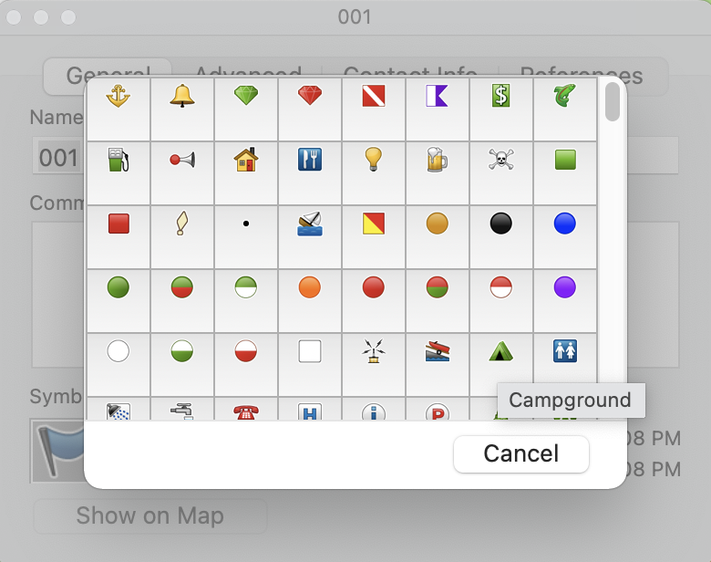

Waypoint defined in a CSV File using the **Campground** Waypoint Symbol Icon (4th comma separated field). 
```csv
40.378513,-105.852245,"Timber Creek Campground","Campground","Rocky Mountains Campground","Trail Ridge Road","Grand Lake","Colorado","80447","USA","970-586-1206"
```
Refer to the following online document [Garmin GPS Unit Waypoint Icons Table](https://freegeographytools.com/2008/garmin-gps-unit-waypoint-icons-table) for a table of Garmin Symbol names you can use. A lot easier than locating a Garmin Symbol icon inside Garmin BaseCamp. *Note: Not all Garmin GPS devices have all Garmin Symbol names built it.*

### Using Custom Waypoint Symbols

If you cannot find an appropriate Garmin Waypoint Symbol Icon for your custom waypoints you can provide and use a custom waypoint symbol icon. There are some websites that have custom waypoint symbol icons that you can download for free.
[POI Factory](http://www.poi-factory.com) is one site. Note: I have used some custom waypoint symbol icons from sites such as [POI Factory](http://www.poi-factory.com) and I had to modify the icon images in order for
them to show up in Garmin BaseCamp and on my Garmin GPS device. 
The symbol image icon file must be a bitmap image and must meet specific criteria in order for the custom symbol image to appear with your custom waypoints in Garmin BaseCamp and on your Garmin GPS Device.
Refer to the Garmin online document [Custom Waypoint Symbol Creation](https://support.garmin.com/en-US/?faq=VTS8XTdjCW5Tx3HyfJ3eQ6) for details on custom waypoint symbols and how to create custom symbol icon image files.

Custom symbol icon image files are stored in Garmin BaseCamp and on Garmin GPS devices with different filenames.
In Garmin BaseCamp the custom symbol icon image files need to have filenames with 3 digit numbers and must be bitmap image files with a file extension of ".bmp".
For example: "**000.bmp**", "**001.bmp**", "**002.bmp**", "**003.bmp**", etc. etc.  
   
On your Garmin GPS device those same custom symbol icon image filenames must be named "**Custom 0.bmp**", "**Custom 1.bmp**", "**Custom 2.bmp**", "**Custom 3.bmp**", etc. etc.

The **csvToGpx** program will copy your custom waypoint symbols to Garmin BaseCamp and to your Garmin GPS device for you automatically as an option.
You do not have to provide 2 copies of every custom symbol image file ("**000.bmp**" and "**Custom 0.bmp**"). You just need to provide the filename named "**000.bmp**" 

To make the **csvToGpx** program copy your custom waypoints to Garmin BaseCamp, specify the [-garmin-basecamp](#-garmin-basecamp) command argument and also specify the [-custom-symbols-directory](#-custom-symbols-directory-directory) command argument with the directory where your custom waypoint symbols are stored. The **csvToGpx** program will copy the files ("**000.bmp**", "**001.bmp**", "**002.bmp**", "**003.bmp**", etc. etc.) to the appropriate Garmin BaseCamp directories on macOS and Windows so they will be visible and available for use in Garmin BaseCamp.

To make the **csvToGpx** program copy your custom waypoints to your Garmin GPS device then specify the [-custom-symbols-directory](#-custom-symbols-directory-directory) command argument and the [-garmin-device](#-garmin-device) argument with the path to your Garmin GPS device.  The **csvToGpx** program will copy the files ("000.bmp", "001.bmp", "002.bmp", "003.bmp", etc. etc.) to the appropriate directory on your Garmin GPS Device (or Micro SD Card) as ("**Custom 0.bmp**", "**Custom 1.bmp**", "**Custom 2.bmp**", etc. etc.) so they will be visible and available for use on your Garmin GPS device. 
        
### Adding a description to Custom Waypoints using Custom Symbols

You can add a "description" after the 3 digit number in a custom symbol icon image filename. 
The **csvToGpx** program will automatically include that "description" in the "Comment" section (1st line) of any custom waypoint that uses that custom symbol.
That "description" will show up in Garmin BaseCamp and your Garmin GPS device in the "Comment" section when you view details on a custom waypoint using that custom symbol.
The **csvToGpx** program will not include that "description" in the custom symbol icon image filename when copying the custom symbol icon image file to Garmin BaseCamp or your Garmin GPS Device.
The "description" needs to be prefix with a dash/minus sign (-) and must immediately follow the 3 digit number in the custom symbol icon image filename.
I myself use that "description" to give a custom waypoint symbol some additional details. 
For instance I have a custom waypoint symbol image for a National Park. It is named "**031-National Park.bmp**".  The text "**National Park**" will be added to the Comment section of any waypoint using the symbol **031**. 

The **csvToGpx** program also adds some additional information in the comment section of a custom waypoints. Refer to the [Waypoint Comment](#waypoint-comment) section below in this document for more details..        

## Waypoint Comment

The **csvToGpx** program generates a detailed "Comment" section for your custom waypoints which can be viewed in Garmin BaseCamp and from your Garmin GPS device. 

The "Comment" will contain the following information (if available) on separate lines for a custom waypoint:

* The name of the custom waypoint from the CSV file.

* The custom "description" retrieved from a custom symbol image filename if the waypoint is using a custom symbol and the custom symbol image file contained a "description". Refer to the [Adding a description to Custom Waypoints using Custom Symbols](#adding-a-description-to-custom-waypoints-using-custom-symbols) section above in this document.

* The description value from the CSV file for the custom waypoint if provided.

* The address from the CSV file for the custom waypoint if provided. 
  
    * Street address value from the CSV file for the custom waypoint if provided.
    * City, State, ZipCode and Country from their values from the CSV file for the custom waypoint if provided.
    * Phone number from the CSV file for the custom waypoint if provided.

    The address is always available in Garmin BaseCamp and does not have to placed in the Waypoint Comment field.
    However on some Garmin GPS devices (hand held) the address is not displayed. 
    By placing the address in the Waypoint Comment field it is viewable from the Garmin GPS device when viewing information on a custom waypoint.     

#### Example of a custom waypoint created by the csvToGpxX program and displayed in Garmin BaseCamp showing the Comment field.

* The waypoint is using the custom waypoint symbol image "**031-National Park.bmp**".


* The CSV custom waypoint record looked like this below.  I specified the custom waypoint symbol number **031** in the 4th comma separated field.

    ```csv
    35.251530,-75.528327,"Cape Hatteras Visitor Center",031,"Visitor Center","46375 Lighthouse Rd","Buxton","North Carolina","27920","USA","252-473-2111"
    ```

* The GPX entry for the above custom waypoint generated by the **csvToGpx** program.  Note: the **`&#10;`** values in the Comment **`<cmt>`** section which are "line breaks" added by the **csvToGpx** program that will separate the fields on different lines when displayed in Garmin BaseCamp and Garmin Devices.

* **Garmin GPX generated for the Custom Waypoint**
    ```xml
    <wpt lat="35.251530" lon="-75.528327">
	<time>2021-07-07T13:22:32Z</time>
	<name>Cape Hatteras Visitor Center</name>
	<cmt>Cape Hatteras Visitor Center&#10;National Park&#10;Visitor Center&#10;46375 Lighthouse Rd&#10;Buxton, North Carolina 27920 USA &#10;252-473-2111</cmt>
	<desc>Visitor Center</desc>
	<sym>Custom 31</sym>
	<type>user</type>
	<extensions>
		<gpxx:WaypointExtension>
			<gpxx:DisplayMode>SymbolAndName</gpxx:DisplayMode>
			<gpxx:Address>
				<gpxx:StreetAddress>46375 Lighthouse Rd</gpxx:StreetAddress>
				<gpxx:City>Buxton</gpxx:City>
				<gpxx:State>North Carolina</gpxx:State>
				<gpxx:Country>USA</gpxx:Country>
				<gpxx:PostalCode>27920</gpxx:PostalCode>
			</gpxx:Address>
			<gpxx:PhoneNumber>252-473-2111</gpxx:PhoneNumber>
		</gpxx:WaypointExtension>
		<wptx1:WaypointExtension>		
			<wptx1:Proximity>10</wptx1:Proximity>
			<wptx1:DisplayMode>SymbolAndName</wptx1:DisplayMode>
			<wptx1:Address>
				<wptx1:StreetAddress>46375 Lighthouse Rd</wptx1:StreetAddress>
				<wptx1:City>Buxton</wptx1:City>
				<wptx1:State>North Carolina</wptx1:State>
				<wptx1:Country>USA</wptx1:Country>
				<wptx1:PostalCode>27920</wptx1:PostalCode>
			</wptx1:Address>
			<wptx1:PhoneNumber>252-473-2111</wptx1:PhoneNumber>
		</wptx1:WaypointExtension>
	</extensions>
    </wpt>
    ```

* **The Custom Waypoint displayed in Garmin BaseCamp after it was manually imported**
    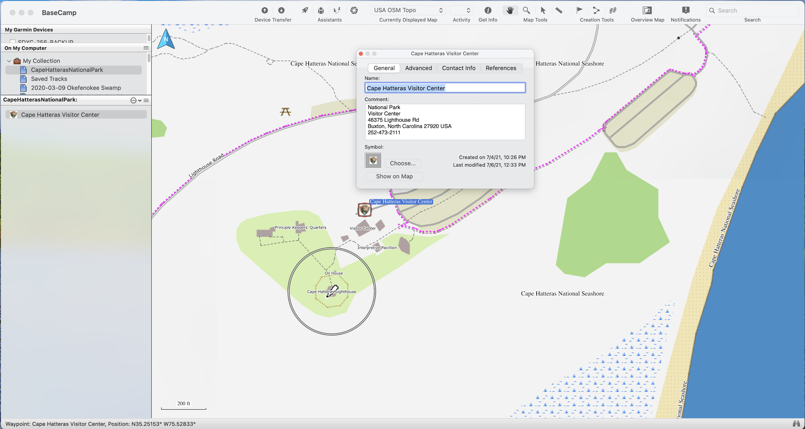

* **The Custom Waypoint displayed on my Garmin Montana 700 GPS device**

    

## Examples

### Example 1

A Garmin GPX file will be created from the csv-file named **NC_StateParks.csv** which contains 41 custom waypoints.

One of the 41 custom waypoints named **Carolina Beach State Park** in the **NC_StateParks.csv** file:
```csv
34.048147,-77.913358,"Carolina Beach State Park","Park","Camping, Hiking, Biking, Paddling, Fishing, Picnicking","1010 State Park Rd","Carolina Beach","North Carolina","28428","USA","(910) 458-8206"
```

```bash
csvToGpx -csv-file NC_StateParks.csv
```

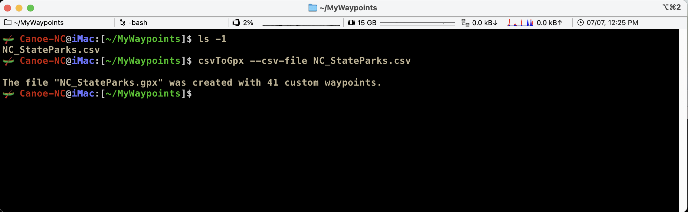

The custom waypoint named **Carolina Beach State Park** in the **NC_StateParks.gpx** file:
```xml
<wpt lat="35.251530" lon="-75.528327">
<time>2021-07-07T13:22:32Z</time>
<name>Cape Hatteras Visitor Center</name>
<cmt>Cape Hatteras Visitor Center&#10;National Park&#10;Visitor Center&#10;46375 Lighthouse Rd&#10;Buxton, North Carolina 27920 USA &#10;252-473-2111</cmt>
<desc>Visitor Center</desc>
<sym>Custom 31</sym>
<type>user</type>
<extensions>
	<gpxx:WaypointExtension>
		<gpxx:DisplayMode>SymbolAndName</gpxx:DisplayMode>
		<gpxx:Address>
			<gpxx:StreetAddress>46375 Lighthouse Rd</gpxx:StreetAddress>
			<gpxx:City>Buxton</gpxx:City>
			<gpxx:State>North Carolina</gpxx:State>
			<gpxx:Country>USA</gpxx:Country>
			<gpxx:PostalCode>27920</gpxx:PostalCode>
		</gpxx:Address>
		<gpxx:PhoneNumber>252-473-2111</gpxx:PhoneNumber>
	</gpxx:WaypointExtension>
	<wptx1:WaypointExtension>		
		<wptx1:Proximity>10</wptx1:Proximity>
		<wptx1:DisplayMode>SymbolAndName</wptx1:DisplayMode>
		<wptx1:Address>
			<wptx1:StreetAddress>46375 Lighthouse Rd</wptx1:StreetAddress>
			<wptx1:City>Buxton</wptx1:City>
			<wptx1:State>North Carolina</wptx1:State>
			<wptx1:Country>USA</wptx1:Country>
			<wptx1:PostalCode>27920</wptx1:PostalCode>
		</wptx1:Address>
		<wptx1:PhoneNumber>252-473-2111</wptx1:PhoneNumber>
	</wptx1:WaypointExtension>
</extensions>
</wpt>
```

#### Manually importing the generated Garmin GPX file **NC_StateParks.gpx** into Gamin BaseCamp.


#### Locating and selecting the Garmin GPX file **NC_StateParks.gpx** and clicking on the Import button.

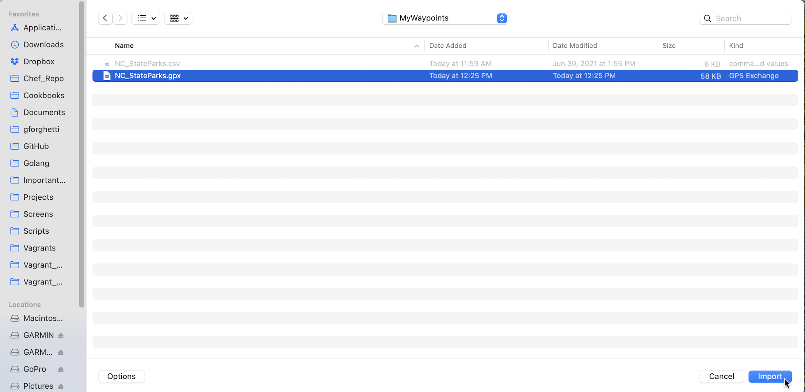

#### The Garmin GPX file **NC_StateParks.gpx** has been imported into Garmin BaseCamp.

The filename **NC_StateParks** (minus the file extension .gpx) appears in the **My_Collection** folder along with the 41 custom waypoints.


### Example 2

A Garmin GPX file will be created from the csv-file named **NC_Lighthouses.csv** which contains 6 custom waypoints.
All 6 custom waypoints are using a custom waypoint symbol icon named **025-Lighthouse.bmp**. 

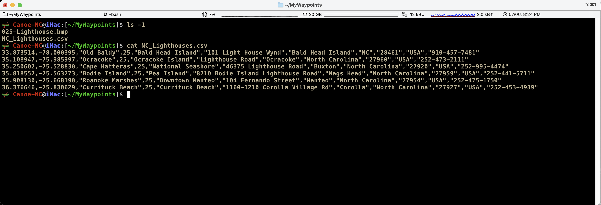

Custom Waypoint Symbol Icon image


Here is the input CSV file **NC_Lighthouses.csv** below. It follows the default csv-fields format. It is using the custom waypoint symbol icon image **25**. 
No need to prefix the symbol number specified in the CSV file with a leading zero to make it 3 digits.

```csv
33.873514,-78.000395,"Old Baldy",25,"Bald Head Island","101 Light House Wynd","Bald Head Island","NC","28461","USA","910-457-7481"
35.108947,-75.985997,"Ocracoke",25,"Ocracoke Island","Lighthouse Road","Ocracoke","North Carolina","27960","USA","252-473-2111"
35.250602,-75.528830,"Cape Hatteras",25,"National Seashore","46375 Lighthouse Road","Buxton","North Carolina","27920","USA","252-995-4474"
35.818557,-75.563273,"Bodie Island",25,"Pea Island","8210 Bodie Island Lighthouse Road","Nags Head","North Carolina","27959","USA","252-441-5711"
35.908130,-75.668190,"Roanoke Marshes",25,"Downtown Manteo","104 Fernando Street","Manteo","North Carolina","27954","USA","252-475-1750"
36.376646,-75.830629,"Currituck Beach",25,"Currituck Beach","1160-1210 Corolla Village Rd","Corolla","North Carolina","27927","USA","252-453-4939"
```

Running the **csvToGpx** program to convert the CSV **NC_Lighthouses.csv** file to the GPX file **NC_Lighthouses.gpx**. The **-garmin-basecamp** and **-custom-symbols-directory** command arguments were specified which triggered the **csvToGpx** program to copy any custom waypoint symbol icon images to the Garmin BaseCamp **Custom Waypoints Symbols** directory.

```bash
csvToGpx -csv-file NC_Lighthouses.csv --garmin-basecamp -custom-symbols-directory ./
```
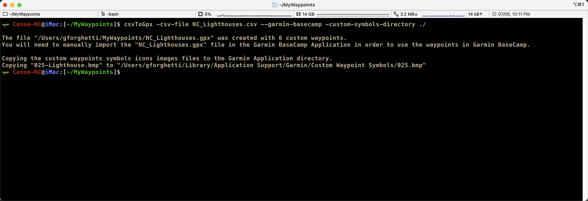

#### Manually importing the generated Garmin GPX file **NC_Lighthouses.gpx** into Gamin BaseCamp.


#### Locating and selecting the Garmin GPX file **NC_Lighthouses.gpx** and clicking on the Import button.
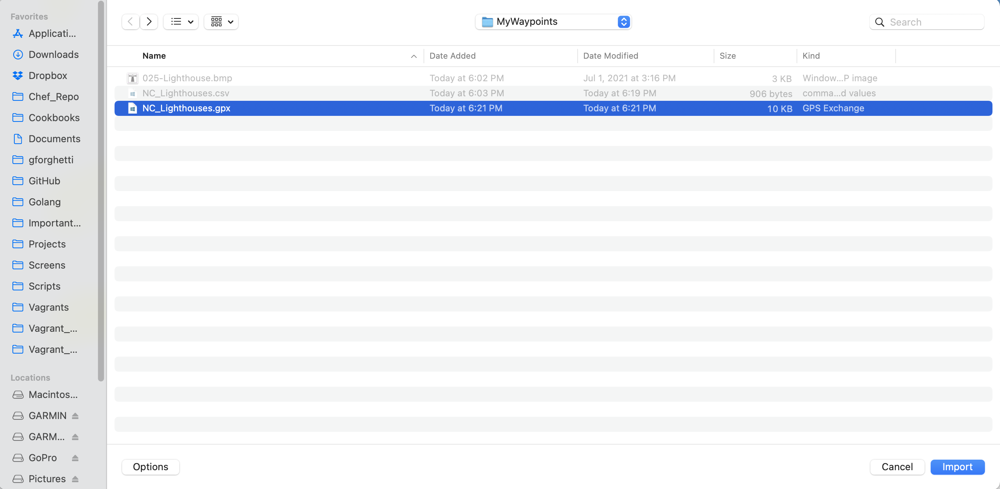

#### The Garmin GPX file **NC_Lighthouses.gpx** has been imported into Garmin BaseCamp.

The filename **NC_Lighthouses** (minus the file extension .gpx) appears in the **My_Collection** folder along with the 6 custom waypoints.
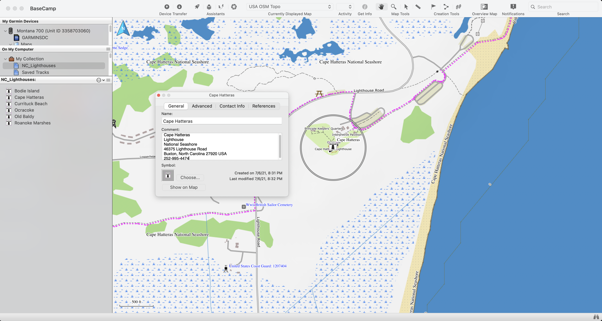

### Example 3

This example is performing the exact same function as [Example 2](#example-2) above with the addition of copying the custom waypoints and custom waypoint symbol icon image file to the micro SD card installed in my Garmin Montana 700 GPS device. I attached my Garmin Montana 700 GPS device to my computer with a USB cable. The Garmin GPS device and the installed micro SD memory card both come online as separate mounted drives.

To search for and display my Garmin Montana 700 GPS device and it's micro SD memory card I issued a **df -h** command piped to a **grep** command from a terminal command prompt.

```bash
df -h | grep -i GARMIN
```

Two Volumes were found. Note: When I formatted the micro SD card I gave it a name of **GARMINSDC**.

1. **/Volumes/GARMINSDC** is the micro SD card which has been installed in my Garmin GPS device. 
2. **/Volumes/GARMIN** is my Garmin GPS Device.

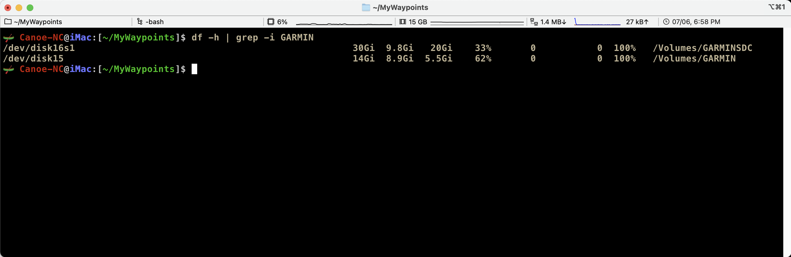

I will be putting the custom waypoints and custom waypoint symbol icon on the Garmin GPS device micro SD card **/Volumes/GARMINSDC**.

Running the **csvToGpx** program to convert the CSV **NC_Lighthouses.csv** file to the GPX file **NC_Lighthouses.gpx**. The **-garmin-device** and **-custom-symbols-directory** command arguments were specified which triggered the **csvToGpx** program to copy the custom waypoints and the custom symbol icon image to the Garmin GPS device micro SD card.

```bash
csvToGpx -csv-file NC_Lighthouses.csv -garmin-basecamp -garmin-device /Volumes/GARMINSDC -custom-symbols-directory ./
```
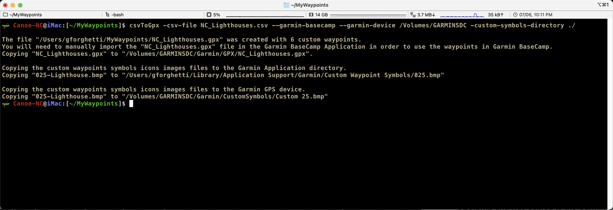

Looking at the messages generated from the **csvToGpx** program you see that the CSV custom waypoints in the **NC_lighthouses.csv** file were converted to GPX in the **NC_lighthouses.GPX** file.
Again the **NC_lighthouses.gpx** file will need to be imported inside Garmin BaseCamp to view and manage the custom waypoints from Garmin BaseCamp.
You also see that the **NC_lighthouses.GPX** file was copied to the Garmin GPS device micro SD card **/Volumes/GARMINSDC**. 

You also see the messages indicating that the custom waypoint symbol icon image file **025-Lighthouse.bmp** was copied to the Garmin Application **Custom Waypoint Symbols** directory as **025.bmp** and was copied to the Garmin GPS device micro SD card as **Custom 25.bmp**. 

Here are the six custom waypoints listed on my Garmin Montana 700 GPS.

<br>

Tapped my finger on the **Cape Hatteras** custom waypoint and the GPS located the custom waypoint on the GPS map.


Tapped my finger on the **Cape Hatteras** text at the top of the GPS map and that displays the custom waypoint information. 
The **Comment** generated by the **csvToGpx** program is displayed.


### Example 4

This example shows how to process multiple CSV files using a `wildcard` filename. I have 3 CSV files in the directory that I wish to convert to GPX files: **NC_CoveredBridges.csv**, **NC_Lighthouses.csv** and **NC_StateParks.csv**.
Two Custom Waypoints Symbols Icons are required: **008-Covered Bridge.bmp** and **025-Lighthouse.bmp** and are stored in a separate subdirectory named **MyCustomSymbols**.

Running the **csvToGpx** program to convert all 3 CSV Files to GPX Files by specifying the **-csv-file** comand argument with the value "**NC_*.csv**".

. The **-garmin-device** and **-custom-symbols-directory** command arguments were also specified which triggered the **csvToGpx** program to copy the custom waypoints and the custom waypoints symbols icons images to the Garmin GPS device micro SD card.

```bash
csvToGpx -csv-file "NC_*.csv" -garmin-basecamp -garmin-device /Volumes/GARMINSDC -custom-symbols-directory ./MyCustomSymbols
```

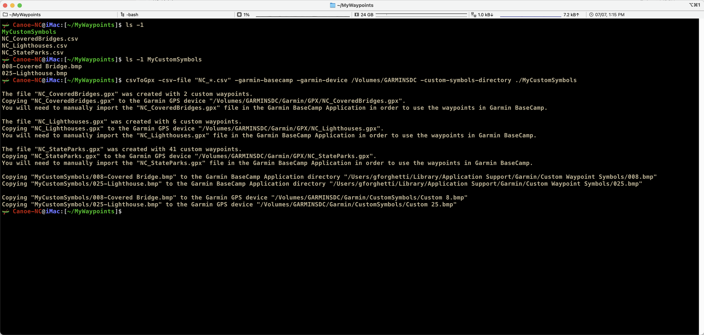

Looking at the messages generated from the **csvToGpx** program you see that the 3 GPX files were generated and copied to the Garmin GPD device micro SD memory card. You can also see that the custom waypoints symbols icons images were copied to the Garmin GPS device micro SD memory card and were also copied to the Garmin BaseCamp **Custom Waypoint Symbols** directory. Again the 3 GPX files will need to be imported inside Garmin BaseCamp to view and manage the custom waypoints from Garmin BaseCamp.